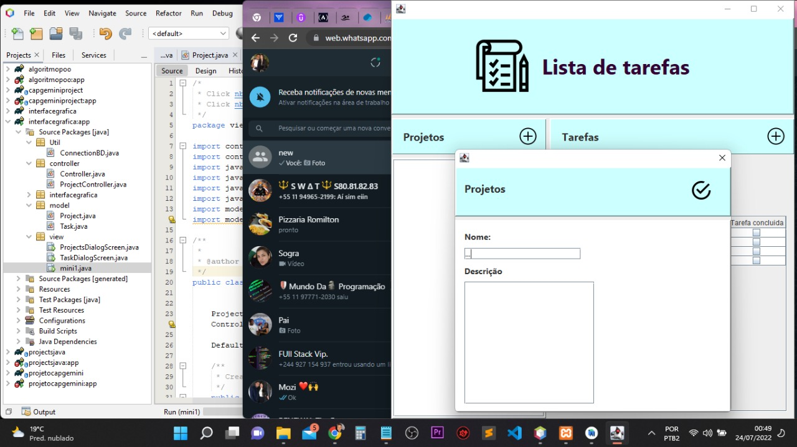
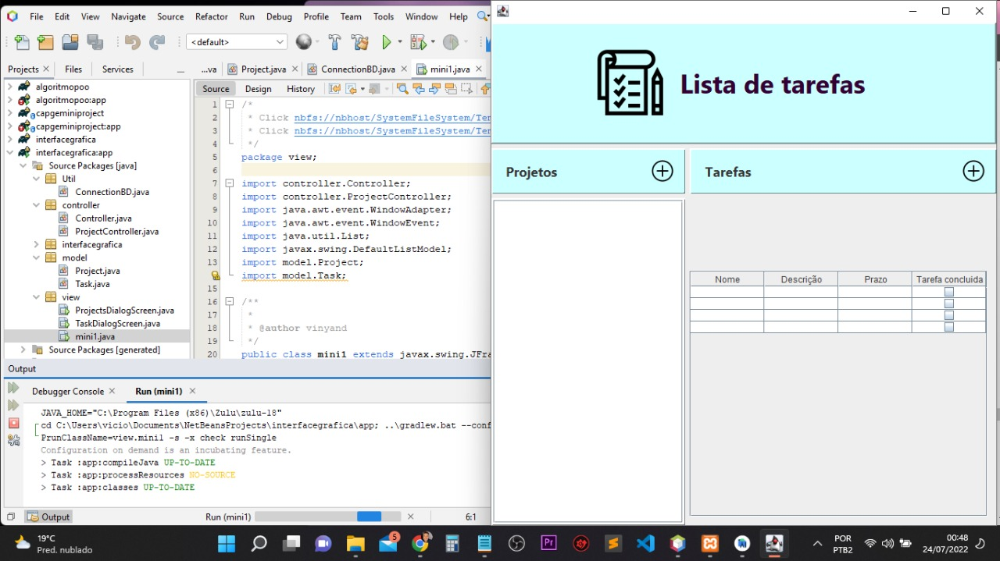

## Definição do projeto desenvolvido:

Todo app - Gerenciamento de tarefas;

### Descrição: 

Aplicação para gerenciamento de projetos e as tarefas
envolvidas nesse projeto.

### Objetivo: 

Resolver a questão da organização de tarefas
de um ou vários projetos.

### Entidades: 

* Projeto;

  - Nome
  - Descrição
  - Data de criação
  - Data da atualização

* Tarefa;

  - Nome;
  - Descrição
  - Status
  - Observações
  - Prazo
  - Data de criação
  - Data da atualização

### Requisitos:

* Permitir criar o projeto;
* Permitir alterar o projeto;
* Permitir deletar o projeto;

* Permitir criar a tarefa;
* Permitir alterar a tarefa;
* Permitir deletar a tarefa;

### Regras de negocio:

* Não irá conter um sitema de login.
* Não haverá o conceito de usúario.
* Toda tarefa deve pertencer a um projeto.

### Tecnologias utilizadas:

* Java;
* MySql;
